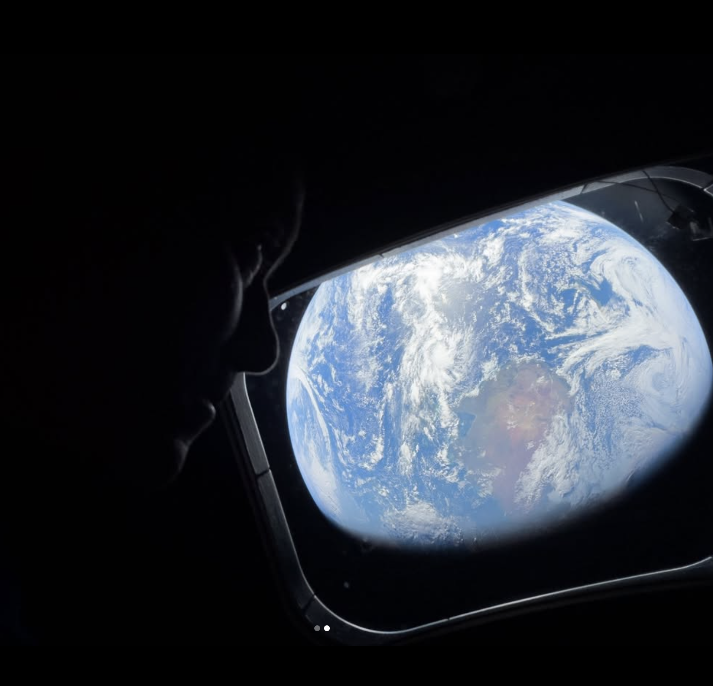
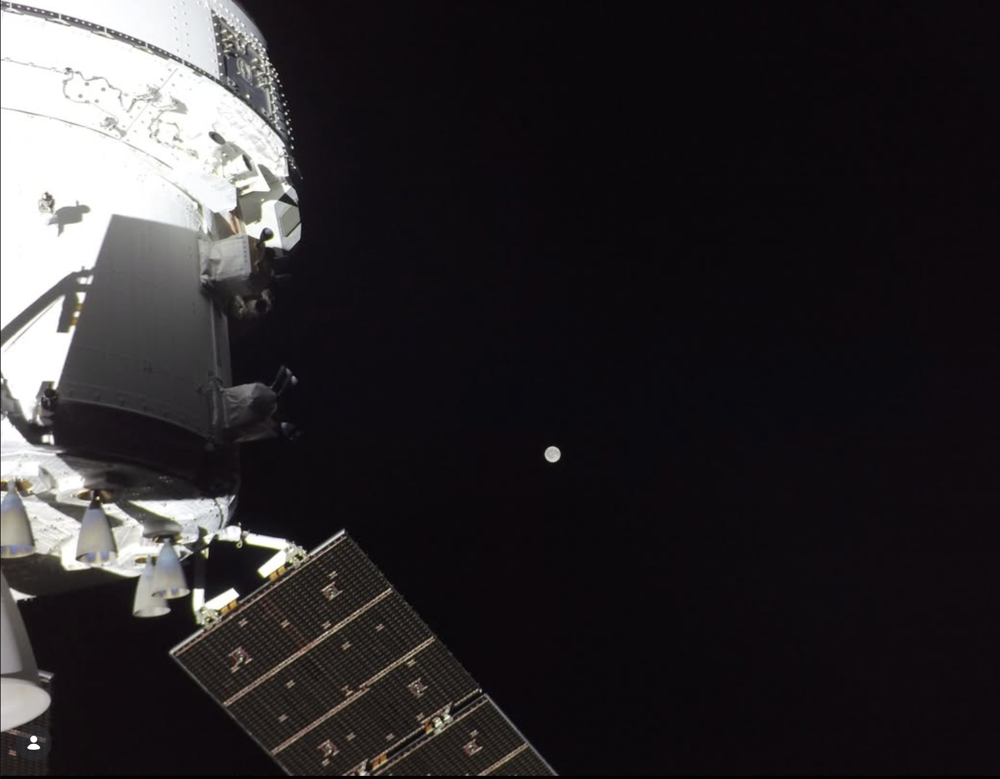

# Artemis II: Humanity's Return to the Moon

> *As of April 7, 2026, the Artemis II crew is approximately Day 6 of their mission — returning from the Moon after a historic lunar flyby. This post covers the full story from preparation to present and what happens after splashdown.*

On April 1, 2026, at 22:35 UTC, a 322-foot Space Launch System rocket lit up the night sky above Kennedy Space Center's Launch Complex 39B. Aboard the Orion capsule: four astronauts about to become the first humans to travel beyond low Earth orbit in over 53 years.

This is Artemis II. Not a landing — a proving flight. A 10-day journey around the Moon and back, testing every system that will one day carry humans to the lunar surface, and eventually, to Mars.

---

## The Crew

Artemis II carries four astronauts, each making history in their own right.

### Reid Wiseman — Commander (NASA)
A former Navy test pilot and veteran of the ISS, Wiseman was selected as Artemis II commander in 2023. At 58, he becomes the oldest person to travel beyond low Earth orbit. He previously served as Chief of the Astronaut Office at NASA. His role: ultimate responsibility for crew safety, mission decisions, and vehicle command.

### Victor Glover — Pilot (NASA)
A Navy Captain and fighter pilot with over 3,000 flight hours, Glover flew to the ISS on the first operational Crew Dragon mission in 2020. On Artemis II he becomes the **first person of color to travel around the Moon** — a milestone with enormous cultural significance 54 years after Apollo's final mission.

### Christina Koch — Mission Specialist 1 (NASA)
Koch holds the record for the longest single spaceflight by a woman (328 days on the ISS). She is the **first woman ever to travel to the Moon** — a barrier that stood for the entire era of human spaceflight. Her expertise in life sciences and EVA operations makes her central to crew health monitoring during the mission.

### Jeremy Hansen — Mission Specialist 2 (Canadian Space Agency)
For Hansen, this is his first spaceflight — and what a first flight. He becomes the **first non-American to travel around the Moon**, reflecting Canada's deep partnership with NASA through the Lunar Gateway program and Canadarm3. The CSA contributed critical hardware to both the SLS and Orion programs.

---

## Why Artemis II Is Not a Landing (And Why That's the Right Call)

Many people ask: why go around the Moon without landing? The answer is engineering discipline.

Artemis I (November 2022) flew the same free-return trajectory with an uncrewed Orion. It was a success by every measure — but post-flight inspection revealed unexpected **heat shield erosion** during reentry. Charred material had ablated in ways the models didn't predict, raising questions about the capsule's safety margins for a crewed return.

NASA convened an independent review team. After months of analysis, they concluded: the heat shield is safe, but we'll fly a slightly steeper reentry angle to reduce the ablation issue. Artemis II became the test of that fix, with a real crew, under real conditions.

This is how spaceflight is done right. You don't skip steps. You don't rush the crewed landing because the public is impatient. You send four people around the Moon first, get them back safely, and then you land.

---

## The Road to Launch: Preparation Timeline

The path from Artemis I's splashdown to Artemis II's launch took over three years. Here is what happened:

### 2023
- **January**: Post-Artemis I heat shield investigation begins
- **September**: RS-25 engines installed on Artemis II core stage at Stennis Space Center
- **October**: Crew announced officially: Wiseman, Glover, Koch, Hansen

### 2024
- **Spring**: Core stage processing continues at Michoud Assembly Facility
- **July–August**: Core stage shipped to Kennedy Space Center
- **November**: Rocket stacking begins in the Vehicle Assembly Building — SLS segments assembled vertically for the first time with Artemis II hardware

### 2025
- **April**: Engine swap completed after valve issues discovered on one RS-25 engine
- **October**: Rocket stacking completed. Full SLS + Orion stack stands 322 feet tall in the VAB
- **December**: Orion crew module final outfitting and crew equipment loading

### 2026
- **February 2**: Wet dress rehearsal reveals liquid hydrogen leak. Mission delayed.
- **February 19**: Second wet dress rehearsal — successful
- **February 21**: Helium flow anomaly discovered. Rocket rolled back to VAB for investigation
- **March 12**: Flight Readiness Review approved. Go for launch
- **March 20**: Final rollout to Launch Complex 39B
- **April 1, 22:35 UTC**: **Launch**

---

## The Mission: Day by Day

### Day 1 — High Earth Orbit System Checkout
After reaching a 23.5-hour elliptical high Earth orbit, the crew began the most critical early phase: **verifying every Orion system works in space before committing to the Moon**.

Life support, propulsion, navigation, communications, suit systems, displays — all checked methodically against pre-planned procedures. If anything had failed here, the crew could have returned to Earth within hours.

The highlight of Day 1: **proximity operations with the spent ICPS upper stage**. Wiseman manually flew Orion to within close range of the inert booster over a 70-minute demonstration — rehearsing the docking skills future Artemis missions will use with the Human Landing System.

### Day 2 — Trans-Lunar Injection
The ICPS fired one final time: a 5-minute, 49-second burn that accelerated Orion from ~17,000 mph to ~24,500 mph — escape velocity from Earth orbit, aimed at the Moon.

This burn placed the crew on a **free-return trajectory**: a precisely calculated arc that loops around the Moon and returns to Earth using only gravity, requiring no additional propulsion for the return. If the main engine failed tomorrow, the crew would still come home. This passive safety margin was a deliberate design choice absent from Apollo missions.

### Days 3–5 — The Outbound Journey

*Image credit: NASA. An Artemis II crew member gazes at Earth through Orion's window during the outbound transit to the Moon.*

Three days of cruise, system monitoring, and crew activities. The crew:
- Tested manual attitude control of Orion (the first human handling of a deep-space vehicle in over 50 years)
- Completed spacesuit fit checks and certification runs — verifying all four suits are ready for emergency use
- Conducted medical monitoring including radiation dosimetry readings (radiation in deep space is significantly higher than on the ISS)
- Observed Earth shrinking to a brilliant sphere in the window — the first humans to see it that way since Gene Cernan's crew in December 1972

### Day 6 — The Lunar Flyby

*Image credit: NASA. The Orion spacecraft with the Moon visible in the distance — captured during Artemis II's deep space transit.*

The emotional and scientific peak of the mission.

**Closest approach: approximately 4,067 miles (6,545 km) from the lunar far side.** Not as close as a landing trajectory, but far beyond anything since Apollo — and intentionally so. The free-return trajectory naturally swings farther out than a powered lunar orbit insertion would.

**Records broken at closest approach:**
- **Farthest humans from Earth ever**: 252,760 miles — surpassing Apollo 13's 248,655 miles
- **Farthest humans beyond the Moon**: ~4,700 miles past the lunar surface
- **Most people in deep space simultaneously**: 4 (Apollo 8 record was 3)

For 40 minutes, Orion passed behind the Moon, cutting off all radio contact with Earth — the same blackout Apollo crews experienced, now repeated for the first time in five decades.

The crew also witnessed a **57-minute solar eclipse** as the Moon blocked the Sun — something no human had seen since the Apollo era.

### Days 7–10 — The Return
Orion now coasts home on its free-return arc. Two trajectory correction burns fine-tune the reentry corridor. The crew monitors all systems, completes science objectives, and prepares for the most demanding phase: reentry.

### Day 10 — Reentry and Splashdown
Orion will re-enter Earth's atmosphere at approximately **25,000 miles per hour** — the fastest crewed reentry in history, faster even than Apollo returns because of Orion's trajectory.

Unlike Artemis I, which used a **skip reentry** (bouncing off the upper atmosphere to shed speed gradually), Artemis II uses a **direct steeper-angle reentry** — the modification NASA made to address the heat shield erosion concern. This is the primary engineering validation of the entire mission.

**Planned splashdown: April 10–11, 2026, Pacific Ocean near San Diego.**
USS San Diego is positioned for recovery, alongside NASA's recovery team and medical personnel.

---

## What Comes After: The Road to the Moon's Surface

Artemis II is a milestone, not a destination. Here is what the program looks like beyond splashdown:

### Artemis III — First Lunar Landing Since 1972 (Planned 2027)
The first crewed landing on the Moon since Apollo 17's Gene Cernan in December 1972. The mission will land near the **lunar south pole** — a region Apollo never visited, chosen because permanently shadowed craters there likely contain **water ice**, a critical resource for long-term exploration and potential fuel production.

**Landing system**: SpaceX Starship Human Landing System (HLS) — a lunar variant of Starship that will carry 2 of the 4 Orion crew members from lunar orbit to the surface and back. The other 2 remain in Orion.

**Surface activities**: 2 EVAs of approximately 2 hours each. The crew will collect samples, deploy instruments, and scout the terrain that future Artemis missions will inhabit for weeks.

### Artemis IV — Lunar Gateway Assembly (Planned 2028)
Artemis IV introduces the **Lunar Gateway** — a small space station in lunar orbit that will serve as a staging point for surface operations. Artemis IV will deliver the first habitation module and begin building humanity's permanent infrastructure beyond Earth orbit.

The Gateway is a fundamentally different approach from Apollo: instead of point-to-point missions, each Artemis mission will build infrastructure that the next one uses.

### Artemis V and Beyond — Extended Surface Operations
Later missions extend surface stays from hours to weeks. Pressurized rovers. Permanent habitats. Resource extraction experiments. The south pole becomes a research base, not just a landing site.

### The Bigger Picture: Moon to Mars
NASA's stated long-term goal is Mars — and the Moon is the proving ground. Every system being tested on Artemis (life support for long duration, radiation mitigation, in-situ resource utilization) is directly applicable to a multi-year Mars transit. Artemis is not nostalgia for Apollo. It is the first phase of interplanetary civilization.

---

## Why This Matters Beyond the Mission

It is easy to process Artemis II as a news event — a launch, some records, a splashdown — and move on. But the significance is larger.

**Generational continuity**: Everyone alive during Apollo who followed the space program closely is now in their 70s or older. For the majority of humans alive today, no one has ever left low Earth orbit in their lifetime. Artemis II is the first time in most people's lives that they can look up and know: right now, there are people near the Moon.

**Diversity**: Christina Koch is the first woman to travel to the Moon. Victor Glover is the first person of color. Jeremy Hansen is the first non-American. These aren't symbolic gestures — they are the natural result of a broader talent pool and a more inclusive astronaut corps. The faces of exploration are changing.

**International partnership**: Artemis is not an American program with international contributors. It is a genuinely multinational effort. Canada, ESA, JAXA, and others contribute hardware, crew, and funding. The Lunar Gateway will be operated by multiple space agencies. This is the model for sustainable deep space exploration.

**Commercial participation**: SpaceX builds the landing system. Blue Origin builds the Gateway's propulsion module. The era of government-only spaceflight is over. Artemis is proof that the public-private model can execute missions as ambitious as anything Apollo attempted.

---

## Image Credits

*All images in this post are courtesy of **NASA** and the **Canadian Space Agency (CSA)**.
NASA imagery is in the public domain. Images sourced from the [NASA Image and Video Library](https://images.nasa.gov/).*

*To explore more Artemis imagery, visit:*
- **[NASA Image Gallery — Artemis](https://www.nasa.gov/humans-in-space/artemis/)** — official mission photography
- **[NASA Flickr](https://www.flickr.com/photos/nasahqphoto/)** — high-resolution press photos
- **[NASA Image and Video Library](https://images.nasa.gov/)** — searchable archive of all NASA imagery

---

## Further Reading

### Official NASA Sources
- **[NASA Artemis Program](https://www.nasa.gov/humans-in-space/artemis/)** — Mission overview, crew bios, updates
- **[Orion Spacecraft](https://www.nasa.gov/orion/)** — Technical details on the capsule
- **[Space Launch System](https://www.nasa.gov/space-launch-system/)** — SLS rocket overview and specifications
- **[Lunar Gateway](https://www.nasa.gov/gateway/)** — The planned lunar space station

### Deep Dives
- **[Artemis II Wikipedia](https://en.wikipedia.org/wiki/Artemis_II)** — Comprehensive mission reference with citations
- **[NASA's Moon to Mars Architecture](https://www.nasa.gov/moontomars/)** — Long-range exploration strategy
- **[Heat Shield Independent Review Report](https://www.nasa.gov/artemis/artemis-i/)** — What NASA found after Artemis I and how they fixed it

### Companion Reading
- **[Why the Lunar South Pole?](https://science.nasa.gov/moon/lunar-south-pole/)** — NASA's explanation of why all Artemis landings target the south pole
- **[Human Research at the Moon](https://humanresearchroadmap.nasa.gov/)** — The medical and physiological challenges of deep space travel
- **[SpaceX Starship HLS](https://www.spacex.com/vehicles/starship/)** — The commercial lander that will carry Artemis III to the surface

---

*The Moon is 238,855 miles away. Right now, four people are closer to it than any human has been since 1972. Follow along at [nasa.gov](https://www.nasa.gov).*
